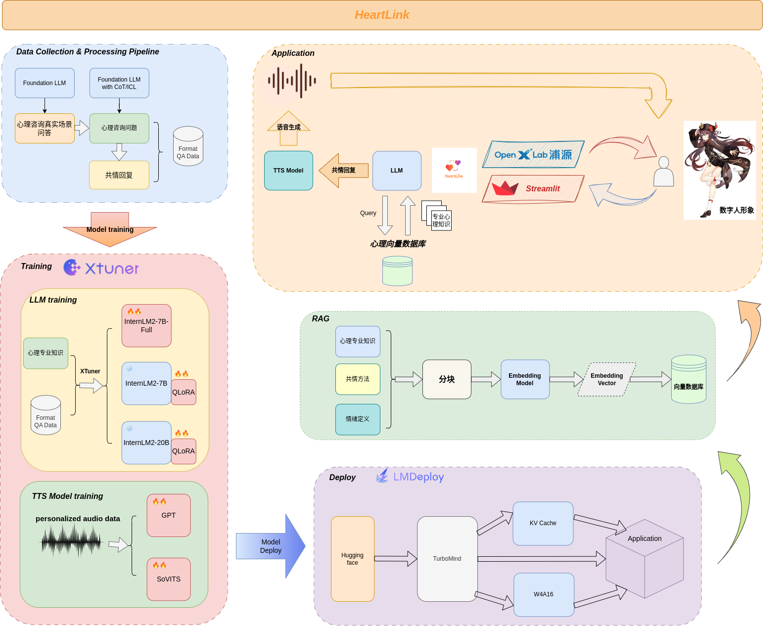
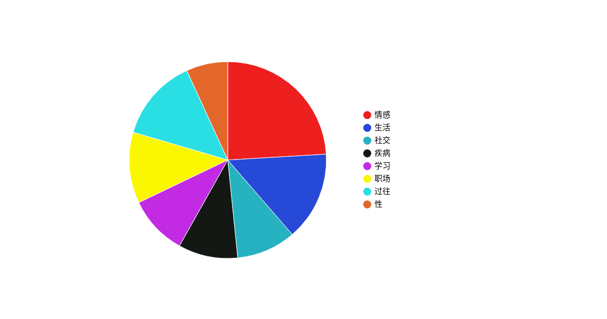

# HeartLink - 心理共情大模型
<div align="center">
  
  <!-- <a href="https://github.com/Nobody-ML/SoulStar/tree/main/">
    
  </a> -->

  <!-- [](https://github.com/Nobody-ML/SoulStar/tree/main/) -->

  <h3 align="center">HeartLink</h3>
  <br /><br />

  [](https://github.com/Nobody-ML/SoulStar/blob/main/LICENSE)

  <!-- 🔍 模型开源地址：
[]()
[]() -->

</div>

## 📖 目录
- [HeartLink - 共情大模型](#HeartLink---共情大模型)
  - [🔄 架构图](#-架构图)
  - [🎉 更新](#-更新)
  - [📝 简介](#-简介)
  - [🛠️ 快速开始](#%EF%B8%8F-快速开始)
    - [1. 算力要求](#1-算力要求)
    - [2. 基于 transformers 使用模型](#2-基于-transformers-使用模型)
    - [3. 通过网页前端体验 demo](#3-通过网页前端体验-demo)
    - [4. 基于 LMDeploy 高性能部署](#4-基于-lmdeploy-高性能部署)
  - [🧾 数据构建](#-数据构建)
  - [🧑‍💻 微调指南](#-微调指南)
  - [📚 应用体验](#-应用体验)
  - [🎖️ 致谢](#%EF%B8%8F-致谢)
  - [开源许可证](#开源许可证)

## 🔄 架构图
<div align="center">
  
</div>

## 🎉 更新
- 【2024.6.20】基于 internlm2-chat 微调出 V1 版模型


## 📝 简介

HeartLink 是一个心理共情大模型，通过 `Large Language Model` 在构建的大型共情问答数据集指令微调而来，能在对话过程中感知用户的情绪与此时用户的经历，通过丰富的心理学知识，给予共情回复，达到理解安慰、共情支持用户的目的。在回复中附有 emoji 表情以拉近与用户的距离，让用户在咨询中得到心理上的支持和帮助。

在此基座共情大模型上构建出了心理共情应用，支持语音合成，在每次回复后播放合成语音；同时支持数字人展示（未完善）；此外还有用户情绪图表分析。

目前支持模型及微调方式列表如下：
|         基座模型          |   微调方式   |
| :-------------------: | :------: |
|   InternLM2-Chat-7B   |  qlora   |
|   InternLM2-Chat-7B   |  full  |
|   InternLM2-Chat-20B   |  qlora   |
|          ……           |    ……    |

项目持续开发中，欢迎  Star⭐、PR 和 Issue。

## 🛠️ 快速开始

### 1. 算力要求
- 对于 7B 的模型推理要求显存至少16G
- 对于 20B 的模型推理要求显存至少40G


### 2. 基于 transformers 使用模型
```python
import torch
from transformers import AutoTokenizer, AutoModelForCausalLM
tokenizer = AutoTokenizer.from_pretrained("HeartLink", trust_remote_code=True)
# 设置`torch_dtype=torch.float16`来将模型精度指定为torch.float16，否则可能会因为您的硬件原因造成显存不足的问题。
model = AutoModelForCausalLM.from_pretrained("HeartLink", device_map="auto",trust_remote_code=True, torch_dtype=torch.float16)

model = model.eval()
response, history = model.chat(tokenizer, "请问你是谁呀？", history=[])
print(response)

response, history = model.chat(tokenizer, "我最近真的好焦虑，课业上给我的作业总是错的，考试时好时坏，我压力真的好大，父母也老是因为学习上的事打骂我，我是不是该放弃学习了？我也没什么朋友，我也想和别人一起玩，一起学习，但是我感觉总是开不了口，一直都是一个人，我该怎么办才好啊，感觉我的人生真的很糟糕，看不到什么希望。", history=history)
print(response)
```
### 3. 通过网页前端体验 demo
```bash
pip install streamlit
pip install transformers
python app.py
```

### 4. 基于 LMDeploy 高性能部署
```shell
# 使用命令行
pip install lmdeploy
lmdeploy chat /root/model/HeartLink  --model-name internlm2
```

## 🧾 数据构建
本项目的训练数据来源于真实心理咨询场景，第一版使用约 180k 轮问答对数据，数据持续 scale 中～

数据涵盖场景丰富，包括了“爱情、婚恋、职场、生活、社会、学习、性、过往、情绪、教育、咨询、危机”等众多丰富的场景。大致划分为：情感、生活、社交、疾病、学习、职场、过往、性。

大致场景数据配比如下：
<div align="center">
  
</div>
- 详情请见[数据构建](./datasets/README.md)


## 🧑‍💻 微调指南
模型使用 XTuner 框架进行微调，使用了 deepseed 进行训练加速。
- 详情请见[微调指南](./finetune_config/xtuner_config/README.md)

## 📚 应用体验
- 应用部署在 [OpenXLab 应用中心](https://openxlab.org.cn/apps/detail/Nobody-ML/HeartLink_7B_qlora_analyse)，可前往体验

## 🎖️ 致谢
- [OpenXLab](https://openxlab.org.cn/home)
- [InternLM](https://github.com/InternLM/InternLM/tree/main)

## 开源许可证

该项目采用 [Apache License 2.0 开源许可证](LICENSE)。同时，请遵守所使用的模型与数据集的许可证。
